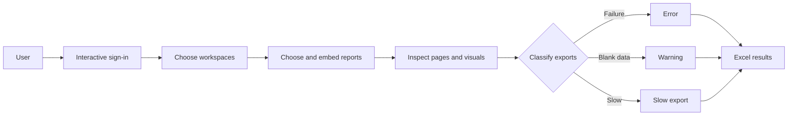

# PULSE 🩺 — Power BI Report Health Checker

**Proof of concept for proactively inspecting Power BI report visuals and surfacing potential failures, blank-data issues, and unusually slow visual exports.**

Power BI developers can otherwise discover a broken or problematic visual only after a user encounters and reports it. PULSE explores whether report pages and visuals can be inspected programmatically so those signals can be reviewed earlier. It is a local, user-operated proof of concept—not a production enterprise monitoring product.

## What PULSE does

PULSE keeps a lightweight Classic Jupyter Notebook interface. It signs a user into Power BI, lists My Workspace plus accessible shared workspaces and reports, embeds selected reports, enumerates their pages and visuals, and attempts summarized-data exports. It classifies:

- export failures as errors;
- exports with no rows or entirely blank columns as warnings;
- exports above a configurable duration as slow;
- exact-match visuals configured by the user as skipped.

When findings exist, PULSE writes a timestamped Excel workbook under `Results/` and offers it through the notebook.



> Demo media placeholder: a sanitized screenshot or short recording can be added after a run against a disposable Power BI tenant. No tenant-specific media is included in this first public version.

## Technology and compatibility

PULSE uses Python, `powerbiclient`, Power BI REST APIs, `ipywidgets`, pandas, and openpyxl. Its dynamic interface calls the Classic Notebook `Jupyter.notebook.*` JavaScript API, so this release deliberately pins **Jupyter Notebook 6.5.7**. Notebook 7 and JupyterLab are not supported by this UI.

Python 3.10–3.12 is recommended. A modern browser and a Power BI account with access to the reports being checked are required.

## Install

```bash
git clone <repository-url>
cd PULSE
python -m venv .venv
```

Activate the environment:

```bash
# macOS/Linux
source .venv/bin/activate

# Windows Command Prompt
.venv\Scripts\activate.bat
```

Then install the reproducible runtime set:

```bash
python -m pip install --upgrade pip
python -m pip install -r requirements.txt
```

## Configure and launch

Configuration is optional for the default interactive flow:

```bash
cp .env.example .env
```

On Windows, copy the file with `copy .env.example .env`. Keep `.env` local; it is ignored by Git.

Run the cross-platform launcher:

```bash
python launch.py
```

Use `python launch.py --check` for environment validation or `--no-browser` when appropriate. Windows users can also double-click `launcher\Launch_PULSE.bat`; it delegates all logic to `launch.py`.

After Classic Notebook opens, review and trust the notebook, then choose **Cell → Run All** once to initialize the interface. For later resets, use **(Re)Start Run**. Choose the network mode, sign in, and follow the workspace/report selectors. Wait until every embedded report has rendered before selecting **Run Analysis**.

## Authentication

The included reference configuration uses one delegated `InteractiveLoginAuthentication` flow from `powerbiclient`. The same user token is reused for Power BI REST discovery and report embedding. `PULSE_TENANT_ID` can optionally constrain the sign-in authority; no client secret is required.

The signed-in user still needs the relevant Power BI license, workspace/report access, and permission to export summarized visual data. Tenant consent and security policies can affect the flow. Authentication is an integration boundary: unattended or enterprise deployments can replace it with organization-approved patterns such as a service principal, managed identity, certificate, or secret stored in a managed vault. Those deployment patterns are intentionally not implemented here.

## Configuration reference

| Variable | Default | Purpose |
|---|---:|---|
| `PULSE_TENANT_ID` | empty | Optional Microsoft Entra tenant ID for interactive sign-in. |
| `PULSE_USE_PAC` | `false` | Default the network selector to automatic PAC proxy mode. |
| `PULSE_REQUEST_TIMEOUT_SECONDS` | `30` | Timeout for Power BI REST discovery requests. |
| `PULSE_SLOW_EXPORT_THRESHOLD_SECONDS` | `2.0` | Include slower exports in `Slow_Exports`. |
| `PULSE_HIGHLIGHT_THRESHOLD_SECONDS` | `5.0` | Highlight very slow Excel rows in red. |
| `PULSE_SKIP_VISUALS_JSON` | `[]` | Local exact-match report/page/visual skip rules. |

PAC support is optional, generic, and disabled by default. When selected, `proxy_support.py` asks PyPAC to discover the host configuration and applies it for Power BI requests. Receiving any HTTP response demonstrates transport connectivity; an unauthenticated Power BI endpoint is not expected to return HTTP 200. Standard mode leaves the host's normal network environment intact.

## Output

Generated workbooks are saved to `Results/PULSE_results_YYYYMMDD_HHMMSS.xlsx`. Depending on findings, they contain:

- `Errors_Warnings` for failed exports and blank-data warnings;
- `Slow_Exports` for exports above the slow threshold, with rows above the highlight threshold colored red;
- `Skipped_Visuals` for configured exact-match exclusions.

The entire `Results/` directory is ignored because filenames and workbook contents can contain report metadata.

## Current limitations

- No live disposable Power BI tenant was available during repository cleanup; authentication through export remains a manual integration test.
- Visual data export support depends on the Power BI visual type, tenant settings, permissions, report state, and `powerbiclient` behavior.
- Blank-data checks are heuristics. A legitimately empty filtered visual may be reported as a warning.
- `powerbiclient` does not expose a safe cancellable timeout for every browser-side operation; a visual export that never responds may require a kernel restart.
- Page switching and rendering are timing-sensitive. Large reports or constrained capacities may need longer waits.
- The current UI is tied to Classic Notebook 6 and is not suitable for unattended scheduling.

## Testing status

Local tests cover duplicate report labels, generic skip configuration, blank-column/header-only exports, slow-only workbook generation, coexisting slow/skipped sheets, and launcher control flow. Syntax, notebook structure, launcher checks, dependency declarations, and publication-safety patterns are also checked locally.

See [docs/MANUAL_TESTING.md](docs/MANUAL_TESTING.md) for the live Power BI checklist and [docs/IMPLEMENTATION_NOTES.md](docs/IMPLEMENTATION_NOTES.md) for the as-found architecture and behavioral change record. Local checks do not substitute for live tenant validation.

A publication-safe CSV, DAX measures, and an exact synthetic report layout are provided in [sample_data/](sample_data/) for a controlled first integration run.

## Security

Never commit `.env`, tokens, tenant-specific identifiers, result workbooks, report screenshots, or logs. Treat report/page/visual names and exported data as potentially sensitive. Review generated files before sharing them. The notebook must only be trusted and run from a source you have reviewed because trusted notebooks can execute Python and browser-side JavaScript.

## Future experiments and collaboration

Useful follow-on work could include a Notebook 7-compatible UI, safer operation-level cancellation, mockable Power BI integration boundaries, richer configurable rules, and validation against a disposable test tenant. Issues and focused contributions are welcome; please avoid including tenant data or credentials in examples.

## License

PULSE is available under the [MIT License](LICENSE). The direct dependencies use permissive MIT, BSD, or Apache-2.0 licenses; see [docs/DEPENDENCY_LICENSES.md](docs/DEPENDENCY_LICENSES.md). Dependency names and licenses remain the property of their respective projects.
